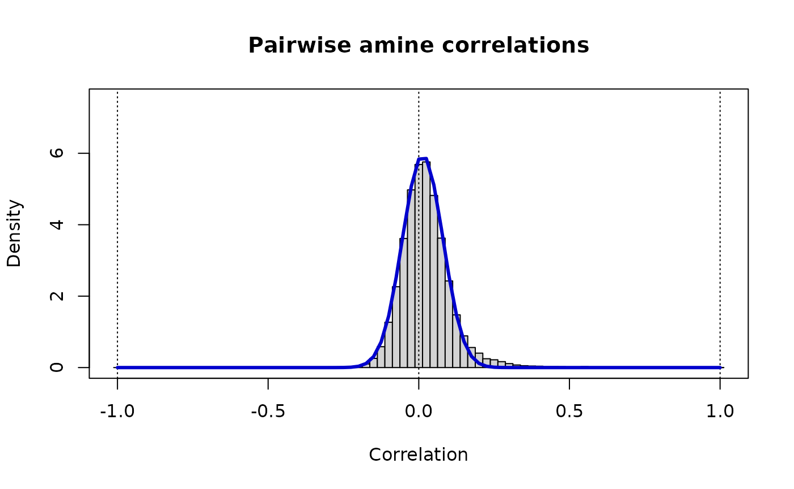
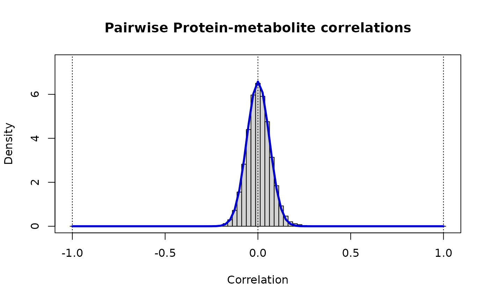
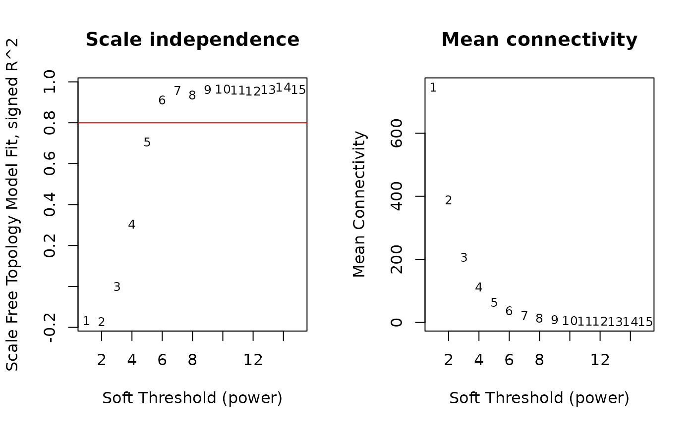
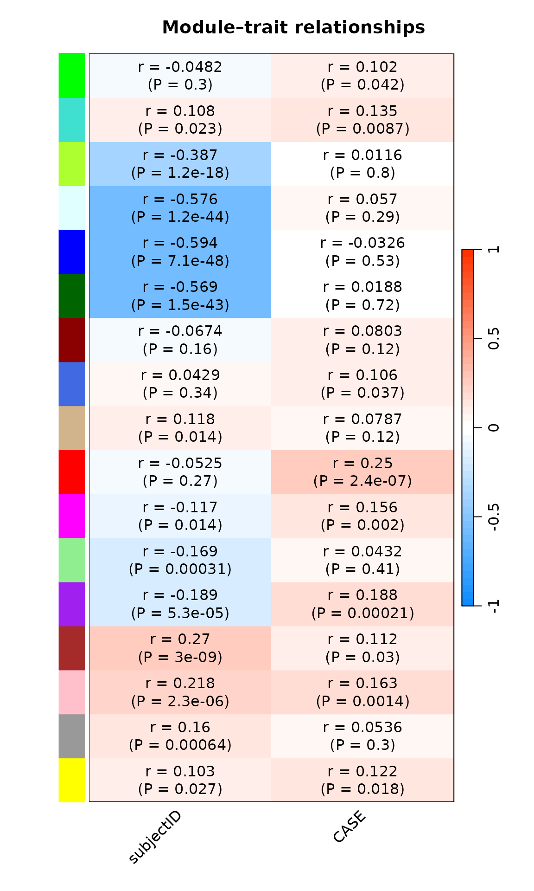

# standardcor-WGCNA

``` r
suppressWarnings(library(standardcor))
#> Loading required package: qlcMatrix
#> Loading required package: Matrix
#> Loading required package: slam
#> Loading required package: sparsesvd
suppressWarnings(library(WGCNA))
#> Loading required package: dynamicTreeCut
#> Loading required package: fastcluster
#> 
#> Attaching package: 'fastcluster'
#> The following object is masked from 'package:stats':
#> 
#>     hclust
#> 
#> 
#> Attaching package: 'WGCNA'
#> The following object is masked from 'package:stats':
#> 
#>     cor
suppressWarnings(library(tidyverse))
#> ── Attaching core tidyverse packages ──────────────────────── tidyverse 2.0.0 ──
#> ✔ dplyr     1.1.4     ✔ readr     2.1.6
#> ✔ forcats   1.0.1     ✔ stringr   1.6.0
#> ✔ ggplot2   4.0.1     ✔ tibble    3.3.0
#> ✔ lubridate 1.9.4     ✔ tidyr     1.3.1
#> ✔ purrr     1.2.0
#> ── Conflicts ────────────────────────────────────────── tidyverse_conflicts() ──
#> ✖ tidyr::expand() masks Matrix::expand()
#> ✖ dplyr::filter() masks stats::filter()
#> ✖ dplyr::lag()    masks stats::lag()
#> ✖ purrr::none()   masks qlcMatrix::none()
#> ✖ tidyr::pack()   masks Matrix::pack()
#> ✖ tidyr::unpack() masks Matrix::unpack()
#> ℹ Use the conflicted package (<http://conflicted.r-lib.org/>) to force all conflicts to become errors
```

## WGCNA, Integration of multi-omics

This notebook covers a correlation standardization technique (more
information here: <https://github.com/PriceLab/standardcor>) to combine
omics for a downstream WGCNA analysis. To combine omics, we start with
correlations separately by each omics. Each omics tends to have a
different distribution of correlations; for example, randomly selected
analytes from a proteomics assay tends to be positively correlated (also
true for transcriptomics), but randomly selected metabolites are
typically closer to uncorrelated. This is not an issue when computing
adjacencies for any of the single ’omics, because the transformation
from correlations to adjacencies would (in WGCNA) be fit to each of
these separate distributions separately. When we combine correlations
across different ’omics, or between analytes measured in different
’omics experiments, WGCNA would attempt to find one power 𝑘 to fit them
all, and that would result in very different distributions of adjacency
for analyte pairs from different source experiments. One particular
source of differences in distribution is sample size. If we compute
correlations between metabolites from 1,000 individuals, we should
expect much more accurate correlation values than if we compute them
from only 10; sampling variation alone will result in a sqrt(1000/10) =
10-fold difference in variance!

We will therefore make a smooth model of the distribution of
correlations of each type, and then transform the correlation values to
a single, shared smooth model. While the resulting values are no longer
interpretable as correlations, this will standardize the significance of
correlations from different sources onto a single, shared significance
scale. When WGCNA fits the values on this scale, it will be applying the
same significance standards to all the correlations, regardless of their
original source.

### Data and preprocessing

The required input files are:

- Phenotype Table - containing the outcome of inPrimary Merest
- MetabolitPrimary e Table - metabolite abunda
- Lipid Table - Lipid abundance values
- Biogenic Amine Table - Biogenic Amine Tablence values
- Protein Table - protein abundance values

Data for this analysis were synthesized from Longevity Consortium
generated proteomic and metabolomic data. We used a Gaussian Mixture
Model (GMM) to create 1000 synthetic participants for each omic type,
500 cases and 500 controls, followed by the addition of a synthetic
case/control signal. The signal was generated by adding 0.1 to a set of
proteins and metabolites for all cases.

The original Longevity Consortium datasets were filtered for high
missingness (\>20%), imputed using random-forest imputation and log
normalized prior to running GMM.

### Load data

``` r
#Phenotypes
pheno <- read_delim("../data/WGCNA/case_synth.tsv", show_col_types = FALSE)

### Load proteins
prots <- read_delim("../data/WGCNA/proteins_synth.tsv", show_col_types = FALSE)

### Metabolites
lipids_df <- read_delim("../data/WGCNA/Lipids_synth.tsv", show_col_types = FALSE)
amines_df  <- read_delim("../data/WGCNA/BA_synth.tsv", show_col_types = FALSE)
primary_df  <- read_delim("../data/WGCNA/Primary_synth.tsv", show_col_types = FALSE)
 
### Metabolite features
features <- read_delim("../data/WGCNA/Met_Features.tsv", show_col_types = FALSE)
```

``` r
## Merge together
in_df <- merge(primary_df, lipids_df, by="subjectID")
in_df <- merge(in_df, amines_df, by="subjectID")
in_df <- merge(in_df, prots, by="subjectID")

# Check dimensions of each dataframe
dim(primary_df)
#> [1] 500 150
dim(lipids_df)
#> [1] 500 713
dim(amines_df)
#> [1] 500 322
dim(prots)
#> [1] 500 284
dim(in_df)
#> [1]  500 1466
dim(pheno)
#> [1] 500   2
```

``` r
# Drop id column and get features
num.analytes <- setdiff(unique(c(colnames(primary_df),colnames(lipids_df),colnames(amines_df),colnames(prots))),'subjectID')
num_df <- in_df[,colnames(in_df) %in% num.analytes]
num_df <- as.matrix(num_df)
rownames(num_df) <- in_df$subjectID
```

``` r
## Filter samples and features based on WGCNA NA criteria (50%)
gsg = goodSamplesGenes(num_df, verbose = 5);
#>  Flagging genes and samples with too many missing values...
#>   ..step 1
gsg$allOK
#> [1] TRUE
if (!gsg$allOK)
{
  # Optionally, print the gene and sample names that were removed:
  if (sum(!gsg$goodGenes)>0) 
    printFlush(paste("Removing genes:", paste(names(num_df)[!gsg$goodGenes], collapse = ", ")));
  if (sum(!gsg$goodSamples)>0) 
    printFlush(paste("Removing samples:", paste(rownames(num_df)[!gsg$goodSamples], collapse = ", ")));
  # Remove the offending genes and samples from the data:
  num_df = num_df[gsg$goodSamples, gsg$goodGenes]
}

dim(num_df)
#> [1]  500 1465
```

``` r
# Get the names of remaining analytes overall (all.analytes) by category
cat.prots <- intersect(colnames(prots),colnames(num_df))
cat.primary  <- intersect(colnames(primary_df),colnames(num_df))
cat.lipid <- intersect(colnames(lipids_df),colnames(num_df))
cat.amines <- intersect(colnames(amines_df),colnames(num_df))

all.analytes <- c(cat.prots,cat.primary,cat.lipid,cat.amines)
print(paste(length(cat.prots),length(cat.lipid),length(cat.primary),length(cat.amines),length(all.analytes)))
#> [1] "283 712 149 321 1465"

# We will construct a correlation matrix Z in parts corresponding to each category of analyte pairs.
n.analytes <- length(all.analytes)
# To compute correlations, features must be numeric. We will use Spearman
all_df <- num_df[,all.analytes]
```

### Generate Correlations

We use an implementation of sparse spearman correlation which saves
memory and time. This helps to prevent the notebook from crashing! We
use Spearman rank correlationsince it is not affected by scalar
multiples or by log-transformation. More information on this technique
can be found here:
<https://github.com/saketkc/blog/blob/main/2022-03-10/SparseSpearmanCorrelation2.ipynbs>

``` r
s.prots <- as(all_df[,cat.prots], "sparseMatrix")
s.primary <- as(all_df[,cat.primary], "sparseMatrix")
s.lipid <- as(all_df[,cat.lipid], "sparseMatrix")
s.amines <- as(all_df[,cat.amines], "sparseMatrix")
```

``` r
# Within-category correlations
Z.pp <- SparseSpearmanCor2(s.prots)
Z.mm <- SparseSpearmanCor2(s.primary)
Z.ll <- SparseSpearmanCor2(s.lipid)
Z.aa <- SparseSpearmanCor2(s.amines)
# Cross-category correlations
Z.pm <- SparseSpearmanCor2(s.prots, s.primary)
Z.pl <- SparseSpearmanCor2(s.prots, s.lipid)
Z.pa <- SparseSpearmanCor2(s.prots, s.amines)
Z.ml <- SparseSpearmanCor2(s.primary, s.lipid)
Z.ma <- SparseSpearmanCor2(s.primary, s.amines)
Z.la <- SparseSpearmanCor2(s.lipid, s.amines)
```

``` r
# Add row and column names to each dataframe
dimnames(Z.pp) <- list(colnames(all_df[,cat.prots]), colnames(all_df[,cat.prots]))
dimnames(Z.mm) <- list(colnames(all_df[,cat.primary]), colnames(all_df[,cat.primary]))
dimnames(Z.ll) <- list(colnames(all_df[,cat.lipid]), colnames(all_df[,cat.lipid]))
dimnames(Z.aa) <- list(colnames(all_df[,cat.amines]), colnames(all_df[,cat.amines]))

dimnames(Z.pm) <- list(colnames(all_df[,cat.prots]), colnames(all_df[,cat.primary]))
dimnames(Z.pl) <- list(colnames(all_df[,cat.prots]), colnames(all_df[,cat.lipid]))
dimnames(Z.pa) <- list(colnames(all_df[,cat.prots]), colnames(all_df[,cat.amines]))
dimnames(Z.ml) <- list(colnames(all_df[,cat.primary]), colnames(all_df[,cat.lipid]))
dimnames(Z.ma) <- list(colnames(all_df[,cat.primary]), colnames(all_df[,cat.amines]))
dimnames(Z.la) <- list(colnames(all_df[,cat.lipid]), colnames(all_df[,cat.amines]))
```

#### Within-category standarized distributions

Below we use the standardcor functions to estimate a Beta parameters
from mean and std dev for each omic.

``` r
### Protein Protein
Z.unique <- Z.pp[row(Z.pp) < col(Z.pp)]
vw <- estimateShape(Z.pp)
v.pp <- vw[1]
w.pp <- vw[2]
print(paste("Protein pairs: rho_ij ~ Beta(v =",round(v.pp,3),",w =",round(w.pp,3),")"))
#> [1] "Protein pairs: rho_ij ~ Beta(v = 34.98 ,w = 34.002 )"

fine <- 40
Bs <- (c(-fine:(1+fine))-0.5)/fine
hist(Z.unique, breaks=Bs, xlab="Correlation", ylab="Density", ylim=c(0,4),
     main="Pairwise protein correlations", prob=TRUE)
box()
abline(v=c(-1:1),lty=3)

r <- c(-fine:fine)/fine
lines(r, dbeta((1+r)/2, v.pp, w.pp)/2, lwd=3, col="MediumBlue")
```


The blue line shows the model distrubtion. We can see it fits the
background distribution. We will repeat this process for all other omics

``` r
### Metabolite-Metabolite
Z.unique <- as.vector(Z.mm[row(Z.mm) < col(Z.mm)])
vw <- estimateShape(Z.mm)
v.mm <- vw[1]
w.mm <- vw[2]
print(paste("Metabolite Pairs: rho_ij ~ Beta(v =",round(v.mm,3),",w =",round(w.mm,3),")"))
#> [1] "Metabolite Pairs: rho_ij ~ Beta(v = 98.489 ,w = 98.706 )"

fine <- 40
Bs <- (c(-fine:(1+fine))-0.5)/fine
hist(Z.unique, breaks=Bs, xlab="Correlation", ylab="Density", ylim=c(0,7.5),
     main="Pairwise primary metabolite correlations", prob=TRUE)
box()
abline(v=c(-1:1),lty=3)

r <- c(-fine:fine)/fine
lines(r, dbeta((1+r)/2, v.mm, w.mm)/2, lwd=3, col="MediumBlue")
```


``` r
### Lipid - Lipid
Z.unique <- as.vector(Z.ll[row(Z.ll) < col(Z.ll)])
vw <- estimateShape(Z.ll)
v.ll <- vw[1]
w.ll <- vw[2]
print(paste("Lipid Pairs: rho_ij ~ Beta(v =",round(v.ll,3),",w =",round(w.ll,3),")"))
#> [1] "Lipid Pairs: rho_ij ~ Beta(v = 27.938 ,w = 25.131 )"

fine <- 40
Bs <- (c(-fine:(1+fine))-0.5)/fine
hist(Z.unique, breaks=Bs, xlab="Correlation", ylab="Density", ylim=c(0,7.5),
     main="Pairwise lipid correlations", prob=TRUE)
box()
abline(v=c(-1:1),lty=3)

r <- c(-fine:fine)/fine
lines(r, dbeta((1+r)/2, v.ll, w.ll)/2, lwd=3, col="MediumBlue")
```


``` r
### Amine - Amine
Z.unique <- as.vector(Z.aa[row(Z.aa) < col(Z.aa)])
vw <- estimateShape(Z.aa)
v.aa <- vw[1]
w.aa <- vw[2]
print(paste("Amine Pairs: rho_ij ~ Beta(v =",round(vw[1],3),",w =",round(vw[2],3),")"))
#> [1] "Amine Pairs: rho_ij ~ Beta(v = 112.787 ,w = 109.907 )"

fine <- 40
Bs <- (c(-fine:(1+fine))-0.5)/fine
hist(Z.unique, breaks=Bs, xlab="Correlation", ylab="Density", ylim=c(0,7.5),
     main="Pairwise amine correlations", prob=TRUE)
box()
abline(v=c(-1:1),lty=3)

r <- c(-fine:fine)/fine
lines(r, dbeta((1+r)/2, vw[1], vw[2])/2, lwd=3, col="MediumBlue")
```



## Cross-category

We continue the same process for each of the cross-category omics
combinations. consider.

``` r
dim(Z.pm)
#> [1] 283 149
Z.unique <- as.vector(Z.pm) # there are no self-comparisons, nor are there repeats due to symmetry
vw <- estimateShape(Z.pm)
v.pm <- vw[1]
w.pm <- vw[2]
print(paste("Protein-metabolite: rho_ij ~ Beta(v =",round(vw[1],3),",w =",round(vw[2],3),")"))
#> [1] "Protein-metabolite: rho_ij ~ Beta(v = 174.852 ,w = 173.513 )"

# The distribution of these cross-correlations is
# markedly narrower than either of the contributing 'omics
fine <- 40
Bs <- (c(-fine:(1+fine))-0.5)/fine
hist(Z.unique, breaks=Bs, xlab="Correlation", ylab="Density", ylim=c(0,7.5),
     main="Pairwise Protein-metabolite correlations", prob=TRUE)
box()
abline(v=c(-1:1),lty=3)

r <- c(-fine:fine)/fine
lines(r, dbeta((1+r)/2, vw[1], vw[2])/2, lwd=3, col="MediumBlue")
```


``` r
# Modeling cross-category correlations: protein-lipid
Z.unique <- as.vector(Z.pl) # there are no self-comparisons, nor are there repeats due to symmetry
vw <- estimateShape(Z.pl)
v.pl <- vw[1]
w.pl <- vw[2]
print(paste("Protein-metabolite: rho_ij ~ Beta(v =",round(vw[1],3),",w =",round(vw[2],3),")"))
#> [1] "Protein-metabolite: rho_ij ~ Beta(v = 87.319 ,w = 89.012 )"

# The distribution of these cross-correlations is
# markedly narrower than either of the contributing 'omics
fine <- 40
Bs <- (c(-fine:(1+fine))-0.5)/fine
hist(Z.unique, breaks=Bs, xlab="Correlation", ylab="Density", ylim=c(0,7.5),
     main="Pairwise Protein-metabolite correlations", prob=TRUE)
box()
abline(v=c(-1:1),lty=3)

r <- c(-fine:fine)/fine
lines(r, dbeta((1+r)/2, vw[1], vw[2])/2, lwd=3, col="MediumBlue")
```


``` r
# Modeling cross-category correlations: protein-amine
Z.unique <- as.vector(Z.pa) # there are no self-comparisons, nor are there repeats due to symmetry
vw <- estimateShape(Z.pa)
v.pa <- vw[1]
w.pa <- vw[2]
print(paste("Protein-metabolite: rho_ij ~ Beta(v =",round(vw[1],3),",w =",round(vw[2],3),")"))
#> [1] "Protein-metabolite: rho_ij ~ Beta(v = 136.503 ,w = 136.271 )"

# The distribution of these cross-correlations is
# markedly narrower than either of the contributing 'omics
fine <- 40
Bs <- (c(-fine:(1+fine))-0.5)/fine
hist(Z.unique, breaks=Bs, xlab="Correlation", ylab="Density", ylim=c(0,7.5),
     main="Pairwise Protein-metabolite correlations", prob=TRUE)
box()
abline(v=c(-1:1),lty=3)

r <- c(-fine:fine)/fine
lines(r, dbeta((1+r)/2, vw[1], vw[2])/2, lwd=3, col="MediumBlue")
```



``` r
# Modeling cross-category correlations: primary-lipid
Z.unique <- as.vector(Z.ml) # there are no self-comparisons, nor are there repeats due to symmetry
vw <- estimateShape(Z.ml)
v.ml <- vw[1]
w.ml <- vw[2]
print(paste("Protein-lipid: rho_ij ~ Beta(v =",round(vw[1],3),",w =",round(vw[2],3),")"))
#> [1] "Protein-lipid: rho_ij ~ Beta(v = 184.501 ,w = 185.53 )"

# The distribution of these cross-correlations is
# markedly narrower than either of the contributing 'omics
fine <- 40
Bs <- (c(-fine:(1+fine))-0.5)/fine
hist(Z.unique, breaks=Bs, xlab="Correlation", ylab="Density", ylim=c(0,7.5),
     main="Pairwise Protein-lipid correlations", prob=TRUE)
box()
abline(v=c(-1:1),lty=3)

r <- c(-fine:fine)/fine
lines(r, dbeta((1+r)/2, vw[1], vw[2])/2, lwd=3, col="MediumBlue")
```


``` r
# Modeling cross-category correlations: primary-amine
Z.unique <- as.vector(Z.ma) # there are no self-comparisons, nor are there repeats due to symmetry
vw <- estimateShape(Z.ma)
v.ma <- vw[1]
w.ma <- vw[2]
print(paste("Protein-amine: rho_ij ~ Beta(v =",round(vw[1],3),",w =",round(vw[2],3),")"))
#> [1] "Protein-amine: rho_ij ~ Beta(v = 184.687 ,w = 184.458 )"

# The distribution of these cross-correlations is
# markedly narrower than either of the contributing 'omics
fine <- 40
Bs <- (c(-fine:(1+fine))-0.5)/fine
hist(Z.unique, breaks=Bs, xlab="Correlation", ylab="Density", ylim=c(0,7.5),
     main="Pairwise Protein-amine correlations", prob=TRUE)
box()
abline(v=c(-1:1),lty=3)

r <- c(-fine:fine)/fine
lines(r, dbeta((1+r)/2, vw[1], vw[2])/2, lwd=3, col="MediumBlue")
```


``` r
# Modeling cross-category correlations: lipid-amine
Z.unique <- as.vector(Z.la) # there are no self-comparisons, nor are there repeats due to symmetry
vw <- estimateShape(Z.la)
v.la <- vw[1]
w.la <- vw[2]
print(paste("Lipid-amine: rho_ij ~ Beta(v =",round(vw[1],3),",w =",round(vw[2],3),")"))
#> [1] "Lipid-amine: rho_ij ~ Beta(v = 125.539 ,w = 125.208 )"

# The distribution of these cross-correlations is
# markedly narrower than either of the contributing 'omics
fine <- 40
Bs <- (c(-fine:(1+fine))-0.5)/fine
hist(Z.unique, breaks=Bs, xlab="Correlation", ylab="Density", ylim=c(0,7.5),
     main="Pairwise lipid-amine correlations", prob=TRUE)
box()
abline(v=c(-1:1),lty=3)

r <- c(-fine:fine)/fine
lines(r, dbeta((1+r)/2, vw[1], vw[2])/2, lwd=3, col="MediumBlue")
```


### Merging correlations from disparate data subsets

This centering process is similar to, but not the same as “quantile
normalization”. In quantile normalization, each value $x_{i}$ in the
observed data has a cumulative probability $p_{i} = \Pr{\{ x < x_{i}\}}$
among the observed data $\{ x\}$ which, accounting for the possibility
of ties in a finite dataset, is the average rank of all observed values
equal to $x_{i}$ divided by the total number of observed values. The
value $x_{i}$ is then transformed to the value $q_{i}$ with cumulative
probability $p_{i}$ according to a normalizing probability distribution
$D$ (i.e. $\Pr{\{ d < q_{i}|D\}} = p_{i}$).

In this centering process, rather than using the rank of $x_{i}$ in the
observed data, we use a null model of the observed data; $p_{i}$ is
therefore a **p-value** for $x_{i}$ under the null model, and the
transformed value $q_{i}$ has the same significance under the normalized
probability distribution $D$ as $x_{i}$ had in the original null
distribution. This allows us to merge datasets while retaining the
significance they had in their original cohort. Only when the empirical
distribution is used as the null model are these two processes the same.

Here, we use a beta distribution as a null model precisely because the
appropriate null model for correlations of arbitrary independent vectors
is, under some reasonable assumptions, indistinguishable from a Beta
distribution. We believe this is a more appropriate null model of
correlations, and suggest that the primary effect of this null model is
to account for the effective number of dimensions in the observed data,
prior to using a 2D geometric model to compute correlations between the
observations.

``` r
nu.std <- 34 # As wide as the widest compoonent, and centered at 0

Zc.pp <- centerBeta(Z.pp, v.pp, w.pp, nu.std)
Zc.mm <- centerBeta(Z.mm, v.mm, w.mm, nu.std)
Zc.ll <- centerBeta(Z.ll, v.ll, w.ll, nu.std)
Zc.aa <- centerBeta(Z.aa, v.aa, w.aa, nu.std)
Zc.pm <- centerBeta(Z.pm, v.pm, w.pm, nu.std)
Zc.pl <- centerBeta(Z.pl, v.pl, w.pl, nu.std)
Zc.pa <- centerBeta(Z.pa, v.pa, w.pa, nu.std)
Zc.ml <- centerBeta(Z.ml, v.ml, w.ml, nu.std)
Zc.ma <- centerBeta(Z.ma, v.ma, w.ma, nu.std)
Zc.la <- centerBeta(Z.la, v.la, w.la, nu.std)
```

``` r
# Combined, centered correlations

Zc <- matrix(0, nrow = length(all.analytes),
             ncol = length(all.analytes))
rownames(Zc) <- all.analytes
colnames(Zc) <- all.analytes
```

``` r
### Construct a final dataframe that contains all the correlation values.
###
# Block-structured correlation matrix
# Zc = [ PP     PM   PL  PA  |
#      | PM^T   MM   ML   MA |
#      | PL^T  MC^T  LL  LA  |
#      | PA^T  MA^T  LA^T AA ]
###
Zc[cat.prots, cat.prots] <- Zc.pp
Zc[cat.primary,  cat.primary]  <- Zc.mm
Zc[cat.lipid,  cat.lipid]  <- Zc.ll
Zc[cat.amines,  cat.amines]  <- Zc.aa

Zc[cat.prots, cat.primary]  <- Zc.pm
Zc[cat.primary, cat.prots]  <- t(Zc.pm)

Zc[cat.prots, cat.lipid]  <- Zc.pl
Zc[cat.lipid, cat.prots]  <- t(Zc.pl)

Zc[cat.prots, cat.amines]  <- Zc.pa
Zc[cat.amines, cat.prots]  <- t(Zc.pa)

Zc[cat.primary, cat.lipid]  <- Zc.ml
Zc[cat.lipid, cat.primary]  <- t(Zc.ml)

Zc[cat.primary, cat.amines]  <- Zc.ma
Zc[cat.amines, cat.primary]  <- t(Zc.ma)

Zc[cat.lipid, cat.amines]  <- Zc.la
Zc[cat.amines, cat.lipid]  <- t(Zc.la)


print(str_c("nrow: ", nrow(Zc)))
#> [1] "nrow: 1465"
Zc[1:5,1:5]
#>              1433Z        A1AG2        A1AT         A1BG        A2AP
#> 1433Z  1.000000000  0.005707413  0.02901604 -0.006209182 -0.28999711
#> A1AG2  0.005707413  1.000000000  0.12406421  0.087104661 -0.17529426
#> A1AT   0.029016044  0.124064205  1.00000000  0.101222530 -0.29220877
#> A1BG  -0.006209182  0.087104661  0.10122253  1.000000000 -0.03940435
#> A2AP  -0.289997110 -0.175294264 -0.29220877 -0.039404352  1.00000000
```

``` r
Z.unique <- Zc[row(Zc) < col(Zc)]
print(paste("Target: rho_ij ~ Beta(v =",round(nu.std,3),",w =",round(nu.std,3),")"))
#> [1] "Target: rho_ij ~ Beta(v = 34 ,w = 34 )"

x <- (1+Z.unique)/2
mZ <- mean(x)
s2Z <- var(x)
v.c <- mZ*(mZ*(1-mZ)/s2Z - 1)
w.c <- (1-mZ)*(mZ*(1-mZ)/s2Z - 1)
print(paste("Method of moments: rho_ij ~ Beta(v =",round(v.c,3),",w =",round(w.c,3),")"))
#> [1] "Method of moments: rho_ij ~ Beta(v = 22.515 ,w = 21.686 )"


fine <- 100
Zc.unique <- as.vector(Zc[row(Zc) < col(Zc)])
Bs <- (c(-fine:(1+fine))-0.5)/fine
hist(Zc.unique, breaks=Bs, xlab="Correlation", ylab="Density", ylim=c(0,5),
     main="All pairwise correlations, centered", prob=TRUE)
box()
abline(v=c(-1:1),lty=3)

r <- c(-fine:fine)/fine
lines(r, dbeta((1+r)/2, nu.std, nu.std)/2, lwd=3, col="orangered")
lines(r, dbeta((1+r)/2, v.c, w.c)/2, lwd=3, col="MediumBlue")
```


These are now standardized correlations. The mean and variance of this
distribution suggest a model (shown in blue) that fits less well than
the standardizing model (in orange); this is a consequence of the
differences between the models we fitted and the empirical
distributions, and indicates that the enrichment of high correlations we
observed in the individual ’omics distributions has been preserved. If
we had used quantile normalization, the overabundance of high
correlations would have been shifted to lower correlation values, and
the fitted blue model would be identical to the standardizing model.

## WGCNA

The code below follows a standard WGCNA analysis. More information can
be found here:
<https://peterlangfelder.com/2018/11/25/wgcna-resources-on-the-web/>

``` r
#Manually convert the pairwise correlation DF to the signed network DF
Zc_signed <- 0.5 + 0.5 * Zc

print(str_c("nrow: ", nrow(Zc_signed)))
#> [1] "nrow: 1465"
```

``` r
#Choose a set of soft-thresholding powers
powers <- c(c(1:10), seq(from=11, to=15, by=1))
cutoff <- 0.8

#Call the network topology analysis function
sft <- pickSoftThreshold.fromSimilarity(Zc_signed, RsquaredCut=cutoff, powerVector=powers, blockSize=5000, verbose=5)
#>  pickSoftThreshold: calculating connectivity for given powers...
#>    ..working on genes 1 through 1465 of 1465
#> Warning: executing %dopar% sequentially: no parallel backend registered
#>    Power SFT.R.sq  slope truncated.R.sq mean.k. median.k. max.k.
#> 1      1 0.167000 12.400          0.944  746.00   745.000  806.0
#> 2      2 0.172000  5.280          0.950  388.00   385.000  459.0
#> 3      3 0.000524  0.143          0.772  206.00   202.000  276.0
#> 4      4 0.305000 -2.210          0.730  113.00   108.000  181.0
#> 5      5 0.705000 -2.770          0.816   63.10    58.700  126.0
#> 6      6 0.910000 -2.870          0.918   36.60    32.600   94.2
#> 7      7 0.957000 -2.590          0.948   22.00    18.300   74.3
#> 8      8 0.936000 -2.350          0.918   13.80    10.500   61.3
#> 9      9 0.963000 -2.060          0.952    9.15     6.140   52.5
#> 10    10 0.965000 -1.850          0.955    6.38     3.660   46.4
#> 11    11 0.960000 -1.710          0.948    4.70     2.250   41.9
#> 12    12 0.954000 -1.600          0.942    3.65     1.420   38.5
#> 13    13 0.963000 -1.500          0.955    2.97     0.895   35.9
#> 14    14 0.974000 -1.430          0.970    2.52     0.581   33.9
#> 15    15 0.963000 -1.390          0.957    2.21     0.380   32.4

#Plot the results
options(repr.plot.width=9, repr.plot.height=5)
par(mfrow=c(1,2))
cex1 <- 0.8
##Scale-free topology fit index as a function of the soft-thresholding power
plot(sft$fitIndices[,1], -sign(sft$fitIndices[,3])*sft$fitIndices[,2],
     xlab="Soft Threshold (power)", ylab="Scale Free Topology Model Fit, signed R^2", type="n",
     main=paste("Scale independence"))
text(sft$fitIndices[,1], -sign(sft$fitIndices[,3])*sft$fitIndices[,2],
     labels=powers, cex=cex1, col="black")
##Line corresponds to using an R^2 cut-off of h
abline(h=cutoff, col="red")
##Mean connectivity as a function of the soft-thresholding power
plot(sft$fitIndices[,1], sft$fitIndices[,5],
     xlab="Soft Threshold (power)", ylab="Mean Connectivity", type="n",
     main=paste("Mean connectivity"))
text(sft$fitIndices[,1], sft$fitIndices[,5], labels=powers, cex=cex1, col="black")
```



``` r

print(str_c("Estimated soft-thresholding power: ", sft$powerEstimate))
#> [1] "Estimated soft-thresholding power: 6"
```

``` r
#Choose the power that best approximates a scale free topology while still maintaining high level of connectivity in the network
softPower <- sft$powerEstimate
softPower
#> [1] 6
#Generate the adjacency matrix using the chosen soft-thresholding power
adjacency <- adjacency.fromSimilarity(Zc, power=softPower, type="signed")

print(str_c("nrow: ", nrow(adjacency)))
#> [1] "nrow: 1465"
#head(adjacency)

#Turn adjacency into topological overlap
##You can input whatever matrix you want here!
# Turn adjacency into topological overlap
TOM = TOMsimilarity(adjacency,TOMType = "signed");
#> ..connectivity..
#> ..matrix multiplication (system BLAS)..
#> ..normalization..
#> ..done.
# Turn into distance matrix
dissTOM = 1-TOM
colnames(dissTOM) <- colnames(all_df)
rownames(dissTOM) <- colnames(dissTOM)
```

``` r
# Cluster the TOM distance matrix to find modules
# Can call whatever clusting method you want here

# Call the hierarchical clustering function
geneTree = hclust(as.dist(dissTOM), method = "ward.D2");
# Plot the resulting clustering tree (dendrogram)
#sizeGrWindow(12,9)
plot(geneTree, xlab="", sub="", main = "Gene clustering on TOM-based dissimilarity",
    labels = FALSE, hang = 0.04);
box()
```


``` r
#Larger modules can be easier to interpret, so we set the minimum module size relatively high
minModuleSize <- max(c(20, round(ncol(all_df)/200, digits=0)))
print(str_c("minClusterSize = ", minModuleSize))
#> [1] "minClusterSize = 20"

#Module identification using dynamic tree cut
dynamicMods <- cutreeDynamic(dendro=geneTree, distM=dissTOM,
                             deepSplit=4, pamStage=TRUE, pamRespectsDendro=FALSE,
                             minClusterSize=minModuleSize)
#>  ..cutHeight not given, setting it to 4.94  ===>  99% of the (truncated) height range in dendro.
#>  ..done.
table(dynamicMods)
#> dynamicMods
#>   1   2   3   4   5   6   7   8   9  10  11  12  13  14  15  16  17  18  19  20 
#> 499 104  94  78  72  63  60  54  48  47  43  39  32  30  29  28  26  26  25  25 
#>  21  22 
#>  22  21

#Convert numeric lables into colors
dynamicColors <- labels2colors(dynamicMods)
table(dynamicColors)
#> dynamicColors
#>        black         blue        brown         cyan    darkgreen      darkred 
#>           60          104           94           30           21           22 
#>        green  greenyellow       grey60    lightcyan   lightgreen  lightyellow 
#>           72           43           26           28           26           25 
#>      magenta midnightblue         pink       purple          red    royalblue 
#>           48           29           54           47           63           25 
#>       salmon          tan    turquoise       yellow 
#>           32           39          499           78

#Plot the dendrogram and colors underneath
options(repr.plot.width=12, repr.plot.height=6)
plotDendroAndColors(geneTree, dynamicColors, "Dynamic Tree Cut",
                    dendroLabels=FALSE, hang=0.03,
                    addGuide=TRUE, guideHang=0.05,
                    main="Gene dendrogram and module colors")
```


``` r
#Calculate eigengenes
MEList <- moduleEigengenes(all_df, colors=dynamicColors, impute=TRUE, nPC=2)
MEs <- MEList$eigengenes
print(str_c("nrow: ", nrow(MEs)))
#> [1] "nrow: 500"
head(MEs)
#>       MEblack       MEblue      MEbrown       MEcyan  MEdarkgreen     MEdarkred
#> 1 -0.04250164 -0.006137058 -0.061119212 -0.017963073  0.083685677  2.766099e-02
#> 2  0.07743639  0.062143054 -0.024485473  0.030683603 -0.021758338 -4.796828e-05
#> 3  0.03539161  0.026002054 -0.073829551  0.011904043  0.006682852  2.677434e-02
#> 4 -0.01816194 -0.021918239  0.006197687 -0.005365383 -0.030132389  1.233884e-02
#> 5  0.01788601  0.014131597 -0.090108419  0.041251157  0.012587136 -6.189113e-02
#> 6  0.02603770  0.001758729 -0.043114754  0.024930105  0.001555772 -1.455030e-02
#>       MEgreen MEgreenyellow     MEgrey60 MElightcyan  MElightgreen
#> 1  0.09667654    0.04224804 -0.011219413  0.02270412 -0.0009493078
#> 2  0.01144213    0.06930301  0.011247960  0.03394327  0.0926655585
#> 3  0.03526924    0.04939254  0.005733386  0.02926117  0.0418565133
#> 4 -0.02069531    0.02095189  0.032070655 -0.00474506 -0.0296049856
#> 5  0.06652515   -0.01577464 -0.105567516  0.02761338  0.0080213115
#> 6  0.06117528    0.01558672 -0.039090274  0.02622454 -0.0552738630
#>   MElightyellow    MEmagenta MEmidnightblue       MEpink     MEpurple
#> 1   0.054813453  0.017014383   -0.060639183 -0.041704707  0.015084532
#> 2   0.006505377  0.021206367    0.041181322  0.016637743  0.070252083
#> 3   0.028960827  0.004705876   -0.013260868 -0.049713898  0.067356769
#> 4   0.010579150  0.037737960   -0.009881932  0.001515955 -0.039509676
#> 5   0.012931648 -0.018482246    0.068292959 -0.094043994 -0.038940804
#> 6  -0.021155760  0.039405631    0.053630301 -0.039897490  0.002201621
#>          MEred  MEroyalblue   MEsalmon         MEtan MEturquoise     MEyellow
#> 1  0.004533408  0.056728907 0.01880385  0.0104194410 -0.03167811 -0.007773314
#> 2  0.022852213 -0.027008752 0.04014007 -0.0451096975  0.01457797 -0.013980877
#> 3  0.065539735  0.034050318 0.03833421 -0.0105466068 -0.05322893 -0.037205440
#> 4  0.005094828  0.003775484 0.01594035 -0.0039805473  0.01949922 -0.013305095
#> 5 -0.056656398 -0.091232433 0.01890705 -0.0649936854 -0.02318406 -0.118914485
#> 6  0.055026948 -0.008089793 0.04426588 -0.0002465442 -0.06392858 -0.075245659

#Calculate dissimilarity of module eigengenes
MEDiss <- 1 - cor(MEs, use="pairwise.complete.obs")

#Cluster module eigengenes
METree <- hclust(as.dist(MEDiss), method="ward.D2")

#Plot the result
options(repr.plot.width=10, repr.plot.height=5)
plot(METree, main="Clustering of module eigengenes",
     xlab="", sub="")
MEDissThres <- 0.3
abline(h=MEDissThres, col="red")
```


``` r
#Call an automatic merging function
merge <- mergeCloseModules(all_df, dynamicColors, cutHeight=MEDissThres, verbose=0)

#Eigengenes of the new merged modules
mergedMEs <- merge$newMEs

#The merged module colors
mergedColors <- merge$colors
table(mergedColors)
#> mergedColors
#>        blue       brown   darkgreen     darkred       green greenyellow 
#>         223          94          46          22          72          43 
#>      grey60   lightcyan  lightgreen     magenta        pink      purple 
#>          26          60          26          48          54          47 
#>         red   royalblue         tan   turquoise      yellow 
#>          63          25          39         499          78

#Plot the dendrogram and module colors
options(repr.plot.width=12, repr.plot.height=6)
plotDendroAndColors(geneTree, cbind(dynamicColors, mergedColors),
                    c("Dynamic Tree Cut", "Merged dynamic"),
                    dendroLabels=FALSE, hang=0.03,
                    addGuide=TRUE, guideHang=0.05,
                    main="Gene dendrogram and module colors")
```


``` r

#Rename
moduleColors <- mergedColors
MEs <- mergedMEs
```

``` r
#Rename
moduleColors <- mergedColors
MEs <- mergedMEs

#Clean the module eigengene table
eigengene_df <- MEs %>%
    rownames_to_column(var="public_client_id")
names(eigengene_df)[2:ncol(eigengene_df)] <- names(eigengene_df)[2:ncol(eigengene_df)] %>%
    str_replace(., "^ME", "") %>%
    str_to_title(.)
print("Module eigengene table")
#> [1] "Module eigengene table"
print(str_c("- nrow: ", nrow(eigengene_df)))
#> [1] "- nrow: 500"
head(eigengene_df)
#>   public_client_id       Green   Turquoise Greenyellow   Lightcyan        Blue
#> 1                1  0.09667654 -0.03167811  0.04224804 0.021016558 -0.03960362
#> 2                2  0.01144213  0.01457797  0.06930301 0.038385247  0.05453270
#> 3                3  0.03526924 -0.05322893  0.04939254 0.035184316  0.01207804
#> 4                4 -0.02069531  0.01949922  0.02095189 0.005809384 -0.01353862
#> 5                5  0.06652515 -0.02318406 -0.01577464 0.024391282  0.04479661
#> 6                6  0.06117528 -0.06392858  0.01558672 0.038461457  0.03384631
#>      Darkgreen       Darkred    Royalblue           Tan          Red
#> 1  0.072203330  2.766099e-02  0.056728907  0.0104194410  0.004533408
#> 2 -0.007447819 -4.796828e-05 -0.027008752 -0.0451096975  0.022852213
#> 3  0.018880591  2.677434e-02  0.034050318 -0.0105466068  0.065539735
#> 4 -0.009537316  1.233884e-02  0.003775484 -0.0039805473  0.005094828
#> 5  0.013223197 -6.189113e-02 -0.091232433 -0.0649936854 -0.056656398
#> 6 -0.010730048 -1.455030e-02 -0.008089793 -0.0002465442  0.055026948
#>        Magenta    Lightgreen       Purple        Brown         Pink
#> 1  0.017014383 -0.0009493078  0.015084532 -0.061119212 -0.041704707
#> 2  0.021206367  0.0926655585  0.070252083 -0.024485473  0.016637743
#> 3  0.004705876  0.0418565133  0.067356769 -0.073829551 -0.049713898
#> 4  0.037737960 -0.0296049856 -0.039509676  0.006197687  0.001515955
#> 5 -0.018482246  0.0080213115 -0.038940804 -0.090108419 -0.094043994
#> 6  0.039405631 -0.0552738630  0.002201621 -0.043114754 -0.039897490
#>         Grey60       Yellow
#> 1 -0.011219413 -0.007773314
#> 2  0.011247960 -0.013980877
#> 3  0.005733386 -0.037205440
#> 4  0.032070655 -0.013305095
#> 5 -0.105567516 -0.118914485
#> 6 -0.039090274 -0.075245659
```

``` r
##Sample metadata
sample_tbl <- pheno[pheno$subjectID %in% rownames(MEs),]
print("Sample metadata after the filter")
#> [1] "Sample metadata after the filter"
print(str_c("- nrow: ", nrow(sample_tbl)))
#> [1] "- nrow: 500"

#Code sex and race
phenotype_tbl <- sample_tbl 

phenotype_tbl <- phenotype_tbl[match(rownames(MEs), rownames(phenotype_tbl)),]
```

``` r
#Calculate the numbers of modules and samples
#nModules <- ncol(MEs)
nSamples <- nrow(phenotype_tbl)

#Names (colors) of the modules
modNames = substring(names(MEs), 3)

##Check ID order before the cor() function
print(str_c("Matched IDs?: ", all(rownames(MEs)==rownames(phenotype_tbl))))
#> [1] "Matched IDs?: TRUE"

#Calculate module–trait relationship
moduleTraitCor <- as.data.frame(cor(MEs, phenotype_tbl, use="p"))
rownames(moduleTraitCor) <- str_to_title(modNames)
print("Module–trait relationship table")
#> [1] "Module–trait relationship table"
print(str_c("nrow: ", nrow(moduleTraitCor)))
#> [1] "nrow: 17"

#Calculate statisitcal significance of module–trait relationship
MTRpval <- as.data.frame(corPvalueStudent(as.matrix(moduleTraitCor), nSamples))
rownames(MTRpval) <- str_to_title(modNames)
print("Module–trait relationship p-value table")
#> [1] "Module–trait relationship p-value table"
print(str_c("- nrow: ", nrow(MTRpval)))
#> [1] "- nrow: 17"

#Eliminate the dummy module (Grey)
moduleTraitCor <- moduleTraitCor[rownames(moduleTraitCor)!="Grey",]
MTRpval <- MTRpval[rownames(MTRpval)!="Grey",]

#P-value adjustment across modules (per trait) using Benjamini–Hochberg method
MTRpval_adj <- as.data.frame(apply(MTRpval, 2, function(x){p.adjust(x, length(x), method="BH")}))
print("Module–trait relationship adjusted p-value table")
#> [1] "Module–trait relationship adjusted p-value table"
print(str_c("- nrow: ", nrow(MTRpval_adj)))
#> [1] "- nrow: 17"

#Prepare text labels as matrix
textMatrix <- paste("r = ",signif(as.matrix(moduleTraitCor), 3),"\n(P = ",
                    signif(as.matrix(MTRpval_adj), 2),")", sep="")
dim(textMatrix) <- dim(moduleTraitCor)
#Revert module names back to apply color conversion
temp_c <- rownames(moduleTraitCor) %>%
    str_to_lower(.) %>%
    str_c("ME",.)
```

``` r
#Visualize
options(repr.plot.width=10, repr.plot.height=10)
par(mar=c(5, 5, 3, 2))
labeledHeatmap(Matrix=moduleTraitCor,
               xLabels=colnames(moduleTraitCor),
               yLabels=temp_c,
               #ySymbols=rownames(moduleTraitCor),
               colorLabels=FALSE,
               colors=blueWhiteRed(50),
               textMatrix=textMatrix,
               setStdMargins=FALSE,
               cex.text=1,
               zlim=c(-1,1),
               main=paste("Module–trait relationships"))
```



Now that we have identified modules asssociated with a phenotype, we can
take the analysis in many other directions. Please refer to the WGCNA
documentation for more information.
